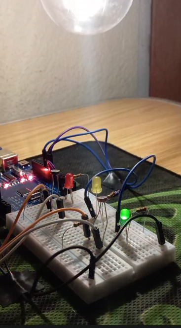

# Smart Sentinel: Dual-Sensor Monitoring System 🛡️💡

This project implements an intelligent light-monitoring system using an Arduino Uno. It features sensor redundancy and fail-safe logic, mimicking real-world defense systems where data reliability is critical.

## 🚀 Overview
The **Smart Sentinel** uses two Photoresistors (LDRs) to monitor ambient light. By calculating the average between two sensors, the system filters out noise and prevents false triggers. It also includes a "Diagnostics Mode" that detects if one sensor is failing or obstructed.

## 🛠️ Hardware Features
* **Dual-Path Sensing:** Two LDRs for data fusion and redundancy.
* **Tri-Color Signaling:**
  * 🟢 **Green:** Safe (High luminosity).
  * 🟡 **Yellow:** Caution (Mid luminosity / Transition).
  * 🔴 **Red:** Alert (Low luminosity / Night mode).
* **PWM Integration:** Smooth brightness transitions (fading) for visual feedback.
* **Fail-Safe Logic:** Rapid yellow flashing if sensor discrepancy exceeds the safety threshold.

## 📟 Project Photos
Here is the hardware setup and the system in action:

<div align="center">
  
  <p><i>Figure 1: Final circuit assembly with labels and cable management.</i></p>
</div>

---

## 💻 Logic & Algorithms
The system is built on three main engineering principles:
1. **Sensor Fusion:** `(LDR1 + LDR2) / 2` to stabilize input data.
2. **Hysteresis:** Prevents "flickering" when light levels are near the threshold.
3. **Discrepancy Check:** ```cpp
   if (abs(s1 - s2) > TOLERANCE) { // Triggers Diagnostic Alert }


   🔧 How to Use

    Clone this repository.

    Connect the components as shown in the schematics.

    Upload sentinel_v1.ino to your Arduino Uno.

    Open the Serial Monitor (9600 baud) to view real-time telemetry.